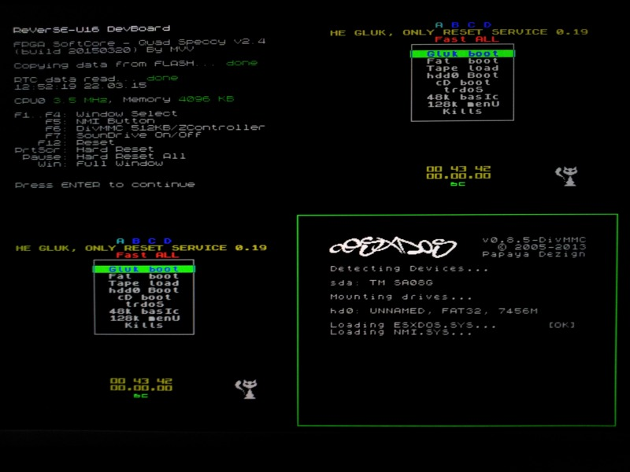
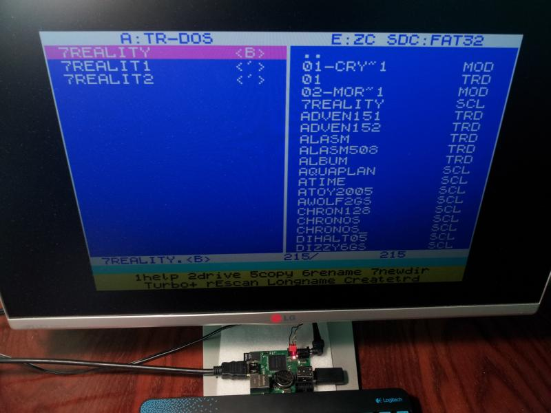

# Quad Speccy v2.4

Поддержка проекта: http://zx-pk.ru/

Quad Speccy - это система "4 in 1", т.е. построена на базе 4-х совместимых ZX-Spectrum, работающих параллельно.

Каждый Speccy состоит из:
- Процессор Z80(T80 SoftCore)
- Память 4 Мбайт (7FFD/DFFD)
- Z-Controller
- DivMMC (512 Kбайт)
- TurboSound (4 x AY8910)
- SounDrive (4 x Covox)
- RTC (MC146818A)

По умолчанию Z-Controller. Для работы пункта Fat boot на карточку CD (FAT16/32) нужно записать FATALL. Для DivMMC записать ESXDOS. Включается нажимаем F6 далее инициализация - удерживаем пробел потом F5, F12.
Выбор требуемого окна процессора для передачи управления от клавиатуры сделан клавишами F1-F4. Также используются клавиши: F5=NMI, F6=DivMMC/Z-Controller, F7=SounDrive On, F12=CPU Reset, PrtScr=Hard Reset, Pause=Hard Reset всех процессоров, Win=Full Window.