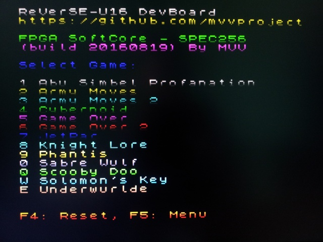

#### SPEC256
 

SPEC256: http://www.emulatronia.com/emusdaqui/spec256/download-eng.htm

игры: http://www.emulatronia.com/emusdaqui/spec256/download-eng.htm

редактор: http://kolmck.net/apps/EmuZ/EmuZWin_Rus.htm

Демонстрационное видео:

build 20160819:
- Video HDMI 640x480@60Hz
- F5 = MENU для загрузки игр
- VNC2 обновлена прошивка
- работают не все игры, требуется правильная адаптация

build 20160629:
- HDMI Audio

build 20160621:
- загрузка игры из SPIFLASH с адреса 0x000B4000 = CYBERNOI.SNA, 0x000C001B = CYBERNOI.GFX
- 8 CPU T80@3.5MHz/7.0MHz
- ROM 16K
- RAM 48K
- Video HDMI 720x480@60Hz
- SDRAM
- USB Keyboard
- F4 = Reset, F5 = NMI
- Sound Beeper (Delta-sigma stereo) порт #FE выведен на разъем uBus(X10)
- исправил encoder, на многих мониторах не работал HDMI
